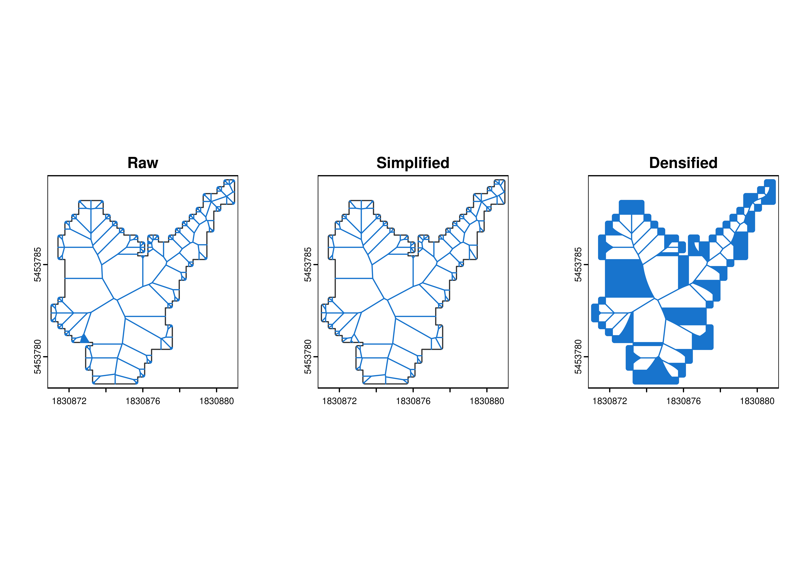
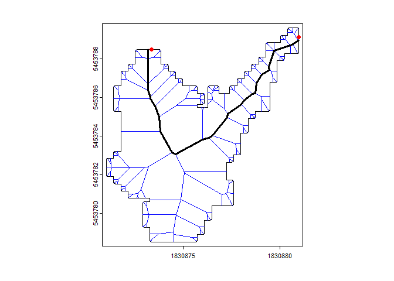

<!-- README.md is generated from README.Rmd. Please edit that file -->

# centerline

<!-- badges: start -->

[](https://github.com/atsyplenkov/centerline/actions/workflows/R-CMD-check.yaml)
[](https://lifecycle.r-lib.org/articles/stages.html#experimental)
[](https://CRAN.R-project.org/package=centerline)


<!-- badges: end -->

The `centerline` R package simplifies the extraction of linear features
from complex polygons, such as roads or rivers, by computing their
centerlines (or median-axis) using Voronoi diagrams. It uses the
super-fast [`geos`](https://paleolimbot.github.io/geos/index.html) and
[`rmapshaper`](http://andyteucher.ca/rmapshaper/index.html) libraries in
the background.

## Installation

You can install the development version of `centerline` from
[GitHub](https://github.com/) with:

``` r
# install.packages("devtools")
devtools::install_github("atsyplenkov/centerline")

# OR

# install.packages("pak")
pak::pak("atsyplenkov/centerline")
```

## Examples for closed geometries

At the heart of this package is the `cent_skeleton` function, which
efficiently computes the skeleton of closed 2D polygonal geometries. The
function uses
[`rmapshaper::ms_simplify()`](http://andyteucher.ca/rmapshaper/reference/ms_simplify.html)
by default to keep the most important nodes and reduce noise from the
beginning.

``` r
library(centerline)
library(terra)
#> terra 1.7.65

polygon <- 
  terra::vect("inst/extdata/example.gpkg", layer = "polygon")

plot(polygon)

pol_skeleton <- 
  cent_skeleton(polygon, simplify = T) 

pol_skeleton |> 
  plot(col = "blue", add = T)
```



However, the above-generated lines are not exactly a centerline of a
polygon. One way to find the centerline of a closed polygon is to define
both `start` and `end` points. For example, in the case of landslides,
it could be the landslide initiation point and landslide terminus.

``` r
# Load points data
points <- terra::vect("inst/extdata/example.gpkg", layer = "polygon_points")

# Connect points
pol_path <-
  cent_path(
    skeleton = pol_skeleton,
    start_point = terra::subset(points, points$type == "start"),
    end_point = terra::subset(points, points$type != "start")
  )

# Plot
plot(polygon)
plot(pol_skeleton, col = "blue", add = T)
plot(points[1:2, ], col = "red",  add = T)
plot(pol_path[[1]], lwd = 3, add = T)
```



## Alternatives

- **R**
  - [midlines](https://github.com/RichardPatterson/midlines) - A more
    hydrology-oriented library that provides a multi-step approach to
    generate a smooth centerline of complex curved polygons (like
    rivers).
  - [cmgo](https://github.com/AntoniusGolly/cmgo) - The main aim of the
    package is to propose a workflow to extract channel bank metrics,
    and as a part of that workflow, centerline extraction was
    implemented.
- 🐍 Python:
  - [centerline](https://github.com/fitodic/centerline/tree/master)
    library
- 🦀 Rust:
  - [centerline_rs](https://codeberg.org/eadf/centerline_rs) library
