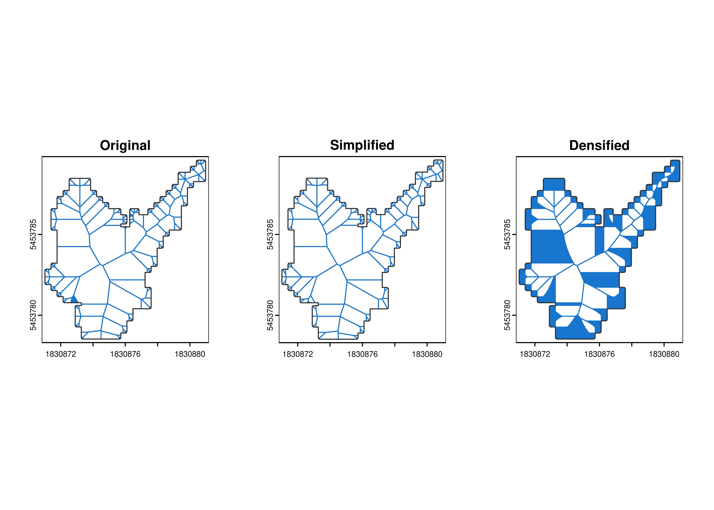
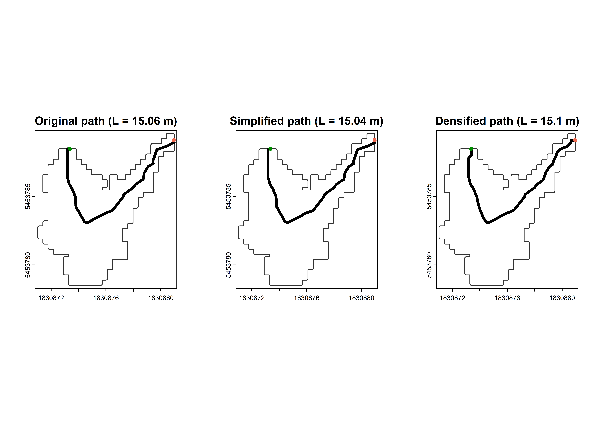
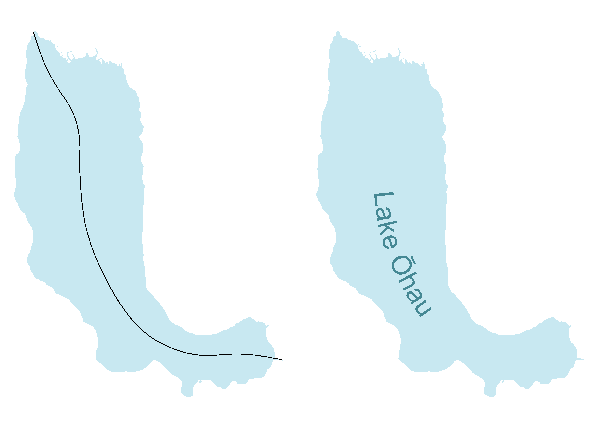

<!-- README.md is generated from README.qmd. Please edit that file -->

# centerline

<!-- badges: start -->

[](https://github.com/atsyplenkov/centerline/actions/workflows/R-CMD-check.yaml)
[](https://lifecycle.r-lib.org/articles/stages.html#experimental)
[](https://CRAN.R-project.org/package=centerline)


<!-- badges: end -->

The `centerline` R package simplifies the extraction of linear features
from complex polygons, such as roads or rivers, by computing their
centerlines (or median-axis) using Voronoi diagrams. It uses the
super-fast [`geos`](https://paleolimbot.github.io/geos/index.html)
library in the background.

## Installation

You can install the development version of `centerline` from
[GitHub](https://github.com/) with:

``` r
# install.packages("devtools")
devtools::install_github("atsyplenkov/centerline")

# OR

# install.packages("pak")
pak::pak("atsyplenkov/centerline")
```

## Examples for closed geometries

At the heart of this package is the `cnt_skeleton` function, which
efficiently computes the skeleton of closed 2D polygonal geometries. The
function uses
[`geos::geos_simplify`](https://paleolimbot.github.io/geos/reference/geos_centroid.html)
by default to keep the most important nodes and reduce noise from the
beginning. However, it has option to densify the amount of points using
[`geos::geos_densify`](https://paleolimbot.github.io/geos/reference/geos_centroid.html),
which can produce more smooth results. Otherwise, you can set the
parameter `keep = 1` to work with the initial geometry.

``` r
library(centerline)
library(terra)
#> terra 1.7.78

# Load Polygon Of Interest (POI)
polygon <-
  terra::vect(
    system.file(
      "extdata/example.gpkg", package = "centerline"
    ),
    layer = "polygon"
  )

# Find POI's skeleton
pol_skeleton <-
  cnt_skeleton(polygon, keep = 1)

# Simplified POI's skeleton
pol_skeleton_simplify <-
  cnt_skeleton(polygon, keep = .1)

# Densified POI's skeleton
pol_skeleton_densify <-
  cnt_skeleton(polygon, keep = 1.5)
```

<details class="code-fold">
<summary>Plot’s code</summary>

``` r
# Plot
par(
  mar = c(0.5, 0.5, 0.2, 0.2),
  mfrow = c(1, 3),
  oma = c(0, 0, 0.2, 0.2)
)

# Raw
plot(pol_skeleton,
     col = "dodgerblue3")
plot(polygon,
     border = "grey20",
     main = "Original",
     add = T)

# Simplified
plot(pol_skeleton_simplify,
     col = "dodgerblue3")
plot(polygon,
     border = "grey20",
     main = "Simplified",
     add = T)

# Densified
plot(pol_skeleton_densify,
     col = "dodgerblue3")
plot(polygon,
     border = "grey20",
     main = "Densified",
     add = T)
```

</details>



However, the above-generated lines are not exactly a centerline of a
polygon. One way to find the centerline of a closed polygon is to define
both `start` and `end` points. For example, in the case of landslides,
it could be the landslide initiation point and landslide terminus.

``` r
# Load points data
points <-
  terra::vect(
    system.file(
      "extdata/example.gpkg", package = "centerline"
    ),
    layer = "polygon_points"
  )

# Connect points
# For original skeleton
pol_path <-
  cnt_path(
    skeleton = pol_skeleton,
    start_point = terra::subset(points, points$type == "start"),
    end_point = terra::subset(points, points$type != "start")
  )

# For simplified skeleton
pol_path_simplify <-
  cnt_path(
    skeleton = pol_skeleton_simplify,
    start_point = terra::subset(points, points$type == "start"),
    end_point = terra::subset(points, points$type != "start")
  )

# For densified skeleton
pol_path_dens <-
  cnt_path(
    skeleton = pol_skeleton_densify,
    start_point = terra::subset(points, points$type == "start"),
    end_point = terra::subset(points, points$type != "start")
  )
```

<details class="code-fold">
<summary>Plot’s code</summary>

``` r
# Plot
par(mfrow = c(1, 3))

# Original
plot(polygon, border = "grey20",
     main = paste0("Original path (L = ",
                   round(terra::perim(pol_path[1, ]), 2), " m)"))
plot(pol_path[1, ], lwd = 3, add = T)
plot(points[1, ], col = "coral2",  add = T)
plot(points[2, ], col = "green4",  add = T)

# Simplified
plot(polygon, border = "grey20",
     main = paste0("Simplified path (L = ",
                   round(terra::perim(pol_path_simplify[1, ]), 2), " m)"))
plot(pol_path_simplify[1, ], lwd = 3, add = T)
plot(points[1, ], col = "coral2",  add = T)
plot(points[2, ], col = "green4",  add = T)

# Densified
plot(polygon, border = "grey20",
     main = paste0("Densified path (L = ",
                   round(terra::perim(pol_path_dens[1, ]), 2), " m)"))
plot(pol_path_dens[1, ], lwd = 3, add = T)
plot(points[1, ], col = "coral2",  add = T)
plot(points[2, ], col = "green4",  add = T)
```

</details>



And what if we don’t know the starting and ending locations? What if we
just want to place our label accurately in the middle of our polygon? In
this case, one may find the `cnt_path_guess` function useful. It returns
the line connecting the most distant points, i.e., the polygon’s length.
Such an approach is used in limnology for measuring [lake
lengths](https://www.lakescientist.com/lake-shape/), for example.

``` r
library(sf)

lake <-
  st_read(
    system.file("extdata/example.gpkg", package = "centerline"),
    layer = "lake",
    quiet = T
  ) |>
  st_cast("POLYGON")

lake_centerline <-
  cnt_path_guess(lake, keep = 1)
```

<details class="code-fold">
<summary>Plot’s code</summary>

``` r
library(ggplot2)
library(geomtextpath)
library(smoothr)
#> 
#> Attaching package: 'smoothr'
#> The following object is masked from 'package:terra':
#> 
#>     densify
#> The following object is masked from 'package:stats':
#> 
#>     smooth

lake_centerline_s <-
  lake_centerline |>
  st_simplify(dTolerance = 150)  |>
  smooth("chaikin")

cnt2 <-
  rbind(
    st_as_sf(lake_centerline_s),
    st_as_sf(lake_centerline_s)
  )

cnt2$lc <- c("black", NA_character_)
cnt2$ll <- c("", lake$name)

ggplot() +
  geom_sf(
    data = lake,
    fill = "#c8e8f1",
    color = NA
  ) +
  geom_textsf(
    data = cnt2,
    aes(
      linecolor = lc,
      label = ll
    ),
    color = "#458894",
    size = 8
  ) +
  scale_color_identity() +
  facet_wrap(~lc) +
  theme_void() +
  theme(strip.text = element_blank())
#> Warning in grid.Call.graphics(C_text, as.graphicsAnnot(x$label), x$x, x$y, :
#> font family not found in Windows font database
#> Warning in grid.Call.graphics(C_text, as.graphicsAnnot(x$label), x$x, x$y, :
#> font family not found in Windows font database
#> Warning in grid.Call.graphics(C_text, as.graphicsAnnot(x$label), x$x, x$y, :
#> font family not found in Windows font database
#> Warning in grid.Call.graphics(C_text, as.graphicsAnnot(x$label), x$x, x$y, :
#> font family not found in Windows font database
#> Warning in grid.Call.graphics(C_text, as.graphicsAnnot(x$label), x$x, x$y, :
#> font family not found in Windows font database
#> Warning in grid.Call.graphics(C_text, as.graphicsAnnot(x$label), x$x, x$y, :
#> font family not found in Windows font database
#> Warning in grid.Call.graphics(C_text, as.graphicsAnnot(x$label), x$x, x$y, :
#> font family not found in Windows font database
#> Warning in grid.Call.graphics(C_text, as.graphicsAnnot(x$label), x$x, x$y, :
#> font family not found in Windows font database
#> Warning in grid.Call.graphics(C_text, as.graphicsAnnot(x$label), x$x, x$y, :
#> font family not found in Windows font database
#> Warning in grid.Call.graphics(C_text, as.graphicsAnnot(x$label), x$x, x$y, :
#> font family not found in Windows font database
#> Warning in grid.Call.graphics(C_text, as.graphicsAnnot(x$label), x$x, x$y, :
#> font family not found in Windows font database
#> Warning in grid.Call.graphics(C_text, as.graphicsAnnot(x$label), x$x, x$y, :
#> font family not found in Windows font database
#> Warning in grid.Call.graphics(C_text, as.graphicsAnnot(x$label), x$x, x$y, :
#> font family not found in Windows font database
#> Warning in grid.Call.graphics(C_text, as.graphicsAnnot(x$label), x$x, x$y, :
#> font family not found in Windows font database
#> Warning in grid.Call.graphics(C_text, as.graphicsAnnot(x$label), x$x, x$y, :
#> font family not found in Windows font database
#> Warning in grid.Call.graphics(C_text, as.graphicsAnnot(x$label), x$x, x$y, :
#> font family not found in Windows font database
#> Warning in grid.Call.graphics(C_text, as.graphicsAnnot(x$label), x$x, x$y, :
#> font family not found in Windows font database
#> Warning in grid.Call.graphics(C_text, as.graphicsAnnot(x$label), x$x, x$y, :
#> font family not found in Windows font database
```

</details>



## Roadmap

    centerline 📦
    ├── Closed geometries (e.g., lakes)
    │   ├── When we do know starting and ending points (e.g., landslides) ✅
    │   │   ├── centerline::cnt_skeleton ✅
    │   │   └── centerline::cnt_path ✅
    │   └── When we do NOT have points (e.g., lakes) ✅
    │       ├── centerline::cnt_skeleton ✅
    │       └── centerline::cnt_path_guess ✅
    ├── Linear objects (e.g., roads or rivers)  🔲
    └── Collapse parallel lines to centerline 🔲

## Alternatives

- **R**
  - [midlines](https://github.com/RichardPatterson/midlines) - A more
    hydrology-oriented library that provides a multi-step approach to
    generate a smooth centerline of complex curved polygons (like
    rivers).
  - [cmgo](https://github.com/AntoniusGolly/cmgo) - The main aim of the
    package is to propose a workflow to extract channel bank metrics,
    and as a part of that workflow, centerline extraction was
    implemented.
- 🐍 Python:
  - [centerline](https://github.com/fitodic/centerline/tree/master)
    library
- 🦀 Rust:
  - [centerline_rs](https://codeberg.org/eadf/centerline_rs) library
- **JS** Javascript:
  - [Centerline labeling
    blogpost](https://observablehq.com/@veltman/centerline-labeling)
