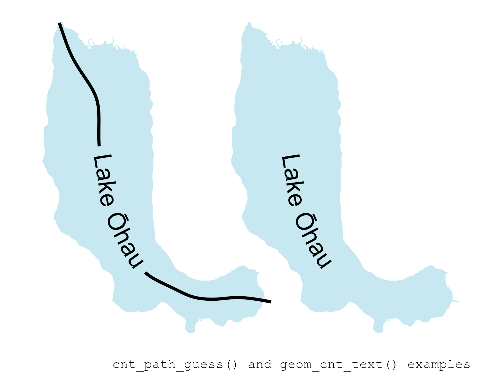

# centerline 

<!-- badges: start -->

[](https://centerline.anatolii.nz/)
[](https://www.repostatus.org/#active)
[](https://github.com/atsyplenkov/centerline/actions/workflows/R-CMD-check.yaml)
[](https://github.com/atsyplenkov/centerline/actions/workflows/CRAN-checks.yaml)
[](https://app.codecov.io/gh/atsyplenkov/centerline)
[](https://CRAN.R-project.org/package=centerline)
[](https://CRAN.R-project.org/package=centerline)
<!-- badges: end -->

The `centerline` R package simplifies the extraction of linear features
from complex polygons, such as roads or rivers, by computing their
centerlines (or median-axis) based on skeletons. It uses the super-fast
[`geos`](https://paleolimbot.github.io/geos/index.html) library in the
background and have bindings for your favorite spatial data library
([`sf`](https://r-spatial.github.io/sf/),
[`terra`](https://rspatial.github.io/terra/) and
[`geos`](https://paleolimbot.github.io/geos/index.html)).

## Installation

``` r
# The easiest way to get centerline is to install it from CRAN:
install.packages("centerline")

# Or the development version from GitHub:
# install.packages("pak")
pak::pak("atsyplenkov/centerline")
```

## Examples for closed geometries

At the heart of this package is the `cnt_skeleton` function, which
efficiently computes the skeleton of closed 2D polygonal geometries. The
function uses
[`geos::geos_simplify`](https://paleolimbot.github.io/geos/reference/geos_centroid.html)
by default to keep the most important nodes and reduce noise from the
beginning. However, it has option to densify the amount of points using
[`geos::geos_densify`](https://paleolimbot.github.io/geos/reference/geos_centroid.html),
which can produce more smooth results. Otherwise, you can set the
parameter `keep = 1` to work with the initial geometry.

``` r
library(sf)
library(centerline)

lake <-
  sf::st_read(
    system.file("extdata/example.gpkg", package = "centerline"),
    layer = "lake",
    quiet = TRUE
  )

# Original
lake_skeleton <-
  cnt_skeleton(lake, keep = 1)

# Simplified
lake_skeleton_s <-
  cnt_skeleton(lake, keep = 0.1)

# Densified
lake_skeleton_d <-
  cnt_skeleton(lake, keep = 2)
```

<details>
<summary>
cnt_skeleton() code 👇
</summary>

``` r
library(ggplot2)

skeletons <-
  rbind(lake_skeleton, lake_skeleton_s, lake_skeleton_d)
skeletons$type <- factor(
  c("Original", "Simplified", "Densified"),
  levels = c("Original", "Simplified", "Densified")
)

skeletons_plot <-
  ggplot() +
  geom_sf(
    data = lake,
    fill = "#c8e8f1",
    color = NA
  ) +
  geom_sf(
    data = skeletons,
    lwd = 0.2,
    alpha = 0.5,
    color = "#263238"
  ) +
  coord_sf(expand = FALSE, clip = "off") +
  labs(caption = "cnt_skeleton() example") +
  facet_wrap(~type) +
  theme_void() +
  theme(
    plot.caption = element_text(family = "mono", size = 6),
    plot.background = element_rect(fill = "white", color = NA),
    strip.text = element_text(face = "bold", hjust = 0.25, size = 12),
    plot.margin = margin(0.2, -0.5, 0.2, -0.5, unit = "lines"),
    panel.spacing.x = unit(-2, "lines")
  )
```

</details>


<br>

However, the above-generated lines are not exactly a centerline of a
polygon. One way to find the centerline of a closed polygon is to define
both `start` and `end` points with the `cnt_path()` function. For
example, in the case of landslides, it could be the landslide initiation
point and landslide terminus.

``` r
# Load Polygon Of Interest (POI)
polygon <-
  sf::st_read(
    system.file(
      "extdata/example.gpkg",
      package = "centerline"
    ),
    layer = "polygon",
    quiet = TRUE
  )

# Load points data
points <-
  sf::st_read(
    system.file(
      "extdata/example.gpkg",
      package = "centerline"
    ),
    layer = "polygon_points",
    quiet = TRUE
  ) |>
  head(n = 2)
points$id <- seq_len(nrow(points))

# Find POI's skeleton
pol_skeleton <- cnt_skeleton(polygon, keep = 1.5)

# Connect points
# For original skeleton
pol_path <-
  cnt_path(
    skeleton = pol_skeleton,
    start_point = subset(points, points$type == "start"),
    end_point = subset(points, points$type == "end")
  )
```

<details>
<summary>
cnt_path() code 👇
</summary>

``` r
path_plot <- ggplot() +
  geom_sf(
    data = polygon,
    fill = "#d2d2d2",
    color = NA
  ) +
  geom_sf(
    data = pol_path,
    lwd = 1,
    color = "black"
  ) +
  geom_sf(
    data = points,
    aes(
      shape = type,
      fill = type
    ),
    color = "white",
    lwd = rel(1),
    size = rel(3)
  ) +
  scale_fill_manual(
    name = "",
    values = c(
      "start" = "dodgerblue",
      "end" = "firebrick"
    )
  ) +
  scale_shape_manual(
    name = "",
    values = c(
      "start" = 21,
      "end" = 22
    )
  ) +
  coord_sf(expand = FALSE, clip = "off") +
  labs(caption = "cnt_path() example") +
  theme_void() +
  theme(
    legend.position = "inside",
    legend.position.inside = c(0.85, 0.2),
    legend.key.spacing.y = unit(-0.5, "lines"),
    plot.caption = element_text(family = "mono", size = 6),
    plot.background = element_rect(fill = "white", color = NA),
    strip.text = element_text(face = "bold", hjust = 0.25, size = 12),
    plot.margin = margin(0.2, -0.5, 0.2, -0.5, unit = "lines"),
    panel.spacing.x = unit(-2, "lines")
  )
```

</details>


<br>

And what if we don’t know the starting and ending locations? What if we
just want to place our label accurately in the middle of our polygon? In
this case, one may find the `cnt_path_guess` function useful. It returns
the line connecting the most distant points, i.e., the polygon’s length.
Such an approach is used in limnology for measuring [lake
lengths](https://www.lakescientist.com/lake-shape/), for example.

``` r
lake_centerline <- cnt_path_guess(lake, keep = 1)
```

You can plot polygon centerlines with the `geom_cnt_*` functions family:

<details>
<summary>
cnt_path_guess() code 👇
</summary>

``` r
library(ggplot2)

lakes <- rbind(lake, lake)
lakes$lc <- c("black", NA_character_) 

centerline_plot <- 
  ggplot() +
  geom_sf(
    data = lakes,
    fill = "#c8e8f1",
    color = NA
  ) +
  geom_cnt_text(
    data = lakes,
    aes(
      label = name,
      linecolor = lc
    ),
    keep = 1
  ) +
  facet_wrap(~lc) +
  labs(
    caption = "cnt_path_guess() and geom_cnt_text() examples"
  ) +
  theme_void() +
  theme(
    legend.position = "inside",
    legend.position.inside = c(0.85, 0.2),
    legend.key.spacing.y = unit(-0.5, "lines"),
    plot.caption = element_text(family = "mono", size = 6),
    plot.background = element_rect(fill = "white", color = NA),
    strip.text = element_blank(),
    plot.margin = margin(0.2, -0.5, 0.2, -0.5, unit = "lines"),
    panel.spacing.x = unit(-2, "lines")
  )
```

</details>



## Roadmap

    centerline 📦
    ├── Closed geometries (e.g., lakes, landslides)
    │   ├── When we do know starting and ending points (e.g., landslides) ✅
    │   │   ├── centerline::cnt_skeleton ✅
    │   │   └── centerline::cnt_path ✅
    │   └── When we do NOT have points (e.g., lakes) ✅
    │       ├── centerline::cnt_skeleton ✅
    │       └── centerline::cnt_path_guess ✅
    ├── Linear objects (e.g., roads or rivers)  🔲
    └── Collapse parallel lines to centerline 🔲

## Alternatives

-   **R**
    -   [midlines](https://github.com/RichardPatterson/midlines) - A
        more hydrology-oriented library that provides a multi-step
        approach to generate a smooth centerline of complex curved
        polygons (like rivers).
    -   [cmgo](https://github.com/AntoniusGolly/cmgo) - The main aim of
        the package is to propose a workflow to extract channel bank
        metrics, and as a part of that workflow, centerline extraction
        was implemented.
    -   [raybevel](https://github.com/tylermorganwall/raybevel) -
        Provides a way to generate **straight** skeletons of polygons.
        This approach is implemented in the
        `cnt_skeleton(method = "straight")` function of the current
        package.
-   🐍 Python:
    -   [centerline](https://github.com/fitodic/centerline/tree/master)
        library
-   🦀 Rust:
    -   [centerline_rs](https://codeberg.org/eadf/centerline_rs) library
-   **JS** Javascript:
    -   [Centerline labeling
        blogpost](https://observablehq.com/@veltman/centerline-labeling)
